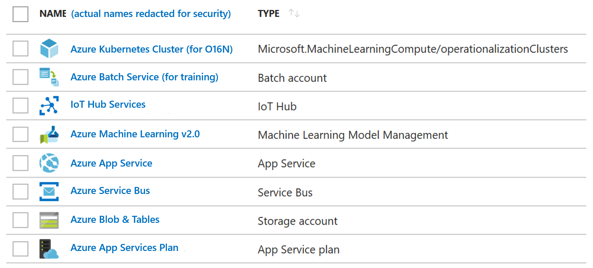

# [Azure AI Predictive Maintenance (PdM) Solution Template](https://github.com/Azure/AI-PredictiveMaintenance)

## Summary
This solution template provides an architectural framework to build end to end, proof-of-concept (POC) solutions for Predictive Maintenance, starting with two scenarios.
- (Use Case 1) Predict failure condition of a machine
- (Use Case 2) Predict that a machine will fail within a future time period, along with its failure type.

with more to be progressively added based on inputs from the field, and customer demand.

The use cases implemented in this template are based on the PdM concepts described in the popular [Predictive Maintenance Playbook (Revised)](./docs/cortana-analytics-playbook-predictive-maintenance.md). Review of this playbook side by side with use of this template is highly recommended. The goal is to keep updating this solution template and the playbook in lock step with new scenarios from both a conceptual and practical standpoint.

### What does this solution template provide?
The end-to-end solution architecture in this template supports data ingestion, data staging, data preparation, model training and test, model deployment, and publication of results. Specifically:

- A configurable data generator that emulates and ingests sensor-based telemetry into Azure IoTHub is provided.

- Data preparation and staging of real-time and stationary data with lag-aggregated telemetry and maintenance logs in Azure Storage is demonstrated. This staged data can be (re)used for model experimentation, and also to demonstrate scoring/operationalization.

- The template provides a DSVM ([Azure Data Science Virtual Machine](https://azure.microsoft.com/en-us/services/virtual-machines/data-science-virtual-machines/)) as the main "workstation" for the practioner. Jupyter Notebooks, Azure ML v2.0, Microsoft Machine Learning Service for R and Python, and a host of other ML tools are preinstalled in the DSVM.  Modeling train-test experiments can be performed in this template as follows:
  - The template demonstrates the use of Jupyter notebooks with PySpark routines for feature-engineering, train and test. This experimentation can be done locally within the DSVM for smaller datasets. For larger datasets, the template enables deployment of Spark clusters using AZTK ([Azure Distributed Data Engineering Toolkit](https://github.com/Azure/aztk)). With a simple switch of the execution kernel, the same PySpark routines can now be executed on these scalable clusters.
  - >By Summer 2018, the template will demonstrate the use of Azure ML v2.0 (with/without Jupter Notebooks) for modeling experimentation - both local to the DSVM and on scalable clusters. For the present, see usage of Azure ML v2.0 Workbench [in this PdM machine learning sample](https://github.com/Azure/MachineLearningSamples-PredictiveMaintenance).
  - If both the above options are not viable, _any_ Python package can be used in Jupyter for model experimentation, but local to the DSVM. For scaled-out machine learning, only PySpark is supported out of the box from the template. In addition, DSVM also enables model experimentation using R.

- Models created using Python toolkits can be operationalized using Azure ML v2.0 for online scoring. A model is created as a zip file from the model creation step. This "pickle file" is registered in AML v2.0. The registered model can then be deployed to a scalable cluster for on-line scoring of new data. This new data can either be real-time, or stationary.

- Results from scoring are published out to Azure Storage for further consumption.

### Audience

- If you are a business decision maker (BDM) looking to reduce the downtime and improve utilization of critical equipment, start with the section _Business case for PdM_ in the [PdM Playbook (Revised)](./docs/cortana-analytics-playbook-predictive-maintenance.md).
- If you are a technical decision maker (TDM) trying to understand PdM technologies, the data science behind them, and the path to their implementation, start with _Data Science for PdM_ section in the [PdM Playbook (Revised)](./docs/cortana-analytics-playbook-predictive-maintenance.md).
- If you are a sofware architect or developer looking to quickly stand up a POC, start with [Solution Template Details](#Solution-Template-Details).

### Prerequisites

You will need an [Azure subscription](https://azure.microsoft.com/en-us/pricing/purchase-options/) and [sufficient quota](https://blogs.msdn.microsoft.com/skeeler/2017/01/subscription-usage-and-quotas-in-the-azure-portal/) for the Azure services shown below.

**NOTE: IMAGE TO BE UPDATED WITH DSVM IN PLACE**

### Estimated Cost and Deployment Time

>NOTE: If you have already deployed this solution, click [here](https://start.cortanaintelligence.com/Deployments) to view your deployment.

The daily cost of running this solution template in its default configuration is $20 per day. The deployment of this solution template completes in 90 minutes if all the cluster resources are available; and may take 3 hours to complete if Azure services are under peak loads.

## Solution Template Details
The rest of the content is organized as follows:

- [Step by Step Deployment Walkthrough](https://github.com/Azure/AI-PredictiveMaintenance/blob/master/docs/Deployment-walkthrough.md)
- [Solution Template Architecture](https://github.com/Azure/AI-PredictiveMaintenance/blob/master/docs/Architecture.md)
- [Model creation and operationalization](https://github.com/Azure/AI-PredictiveMaintenance/blob/master/docs/Data-Science.md)
- [Frequently Asked Questions](https://github.com/Azure/AI-PredictiveMaintenance/blob/master/docs/FAQ.md)
- [Release Notes and Trouble Shooting Guide](https://github.com/Azure/AI-PredictiveMaintenance/blob/master/docs/Release-Notes.md)

## Data/Telemetry
This solution template collects usage data and sends it to Microsoft to help improve our products and services. Read our [privacy statement](https://privacy.microsoft.com/en-us/privacystatement) to learn more.

## Contributing
This project welcomes contributions and suggestions. Most contributions require you to agree to a Contributor License Agreement (CLA) declaring that you have the right to, and actually do, grant us the rights to use your contribution. For details, visit https://cla.microsoft.com.

When you submit a pull request, a CLA-bot automatically determines whether you need to provide a CLA and decorates the pull request appropriately. You only need to follow the instructions provided by the bot across all Microsoft repositories to use our CLA.

This project has adopted the [Microsoft Open Source Code of Conduct](https://opensource.microsoft.com/codeofconduct/). More information is available at Code of Conduct FAQ. Contact opencode@microsoft.com with any additional questions or comments.