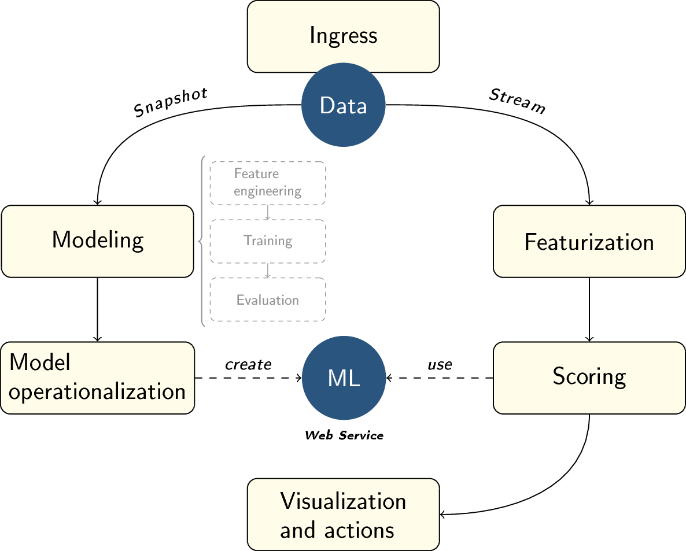
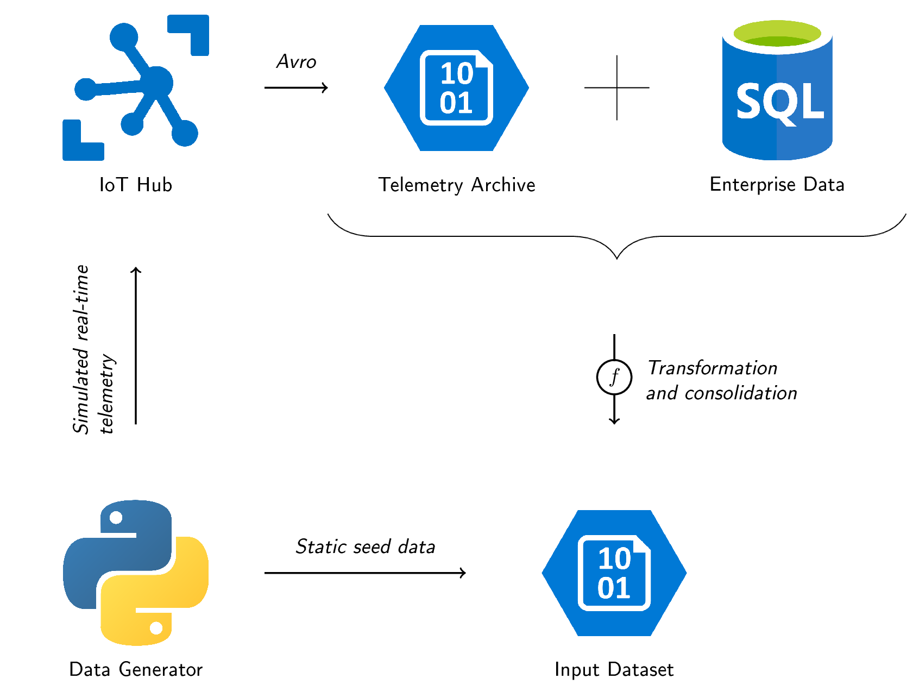
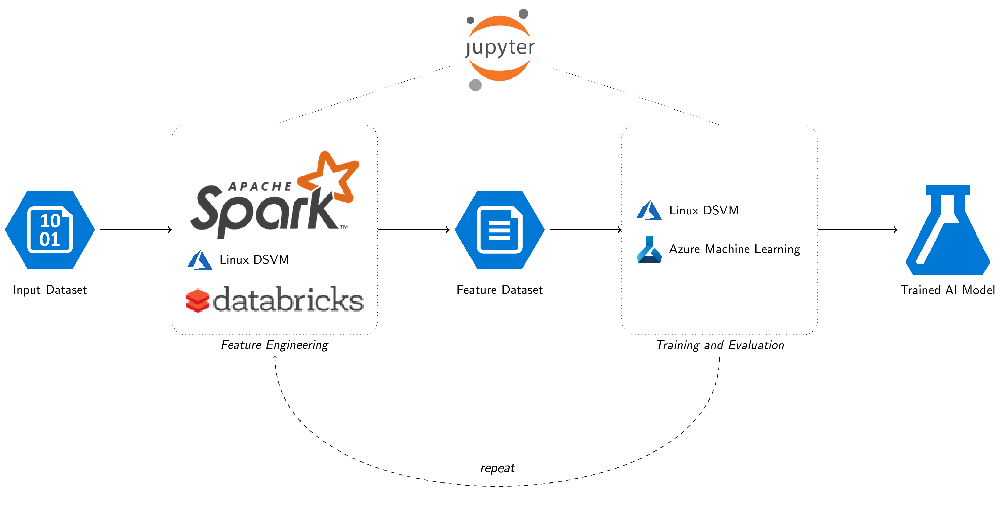
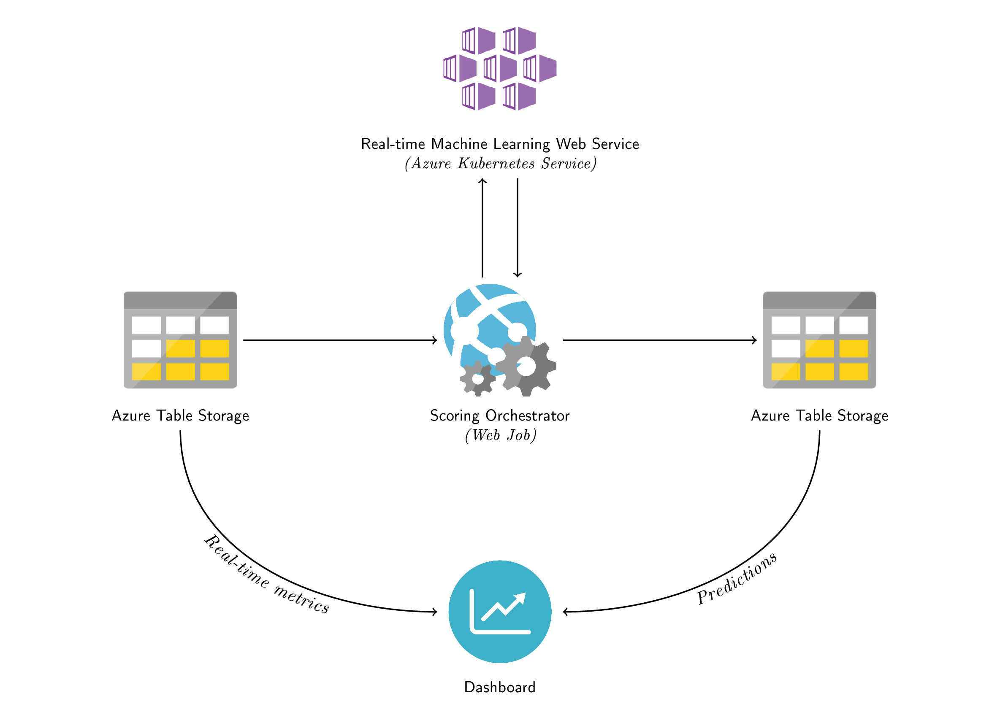

# Introduction

Applying Artificial Intelligence to business problems has not been practical for most mainstream organizations. Recent developments in cloud computing such as inexpensive storage and scalable on-demand compute have changed that. The cloud has enabled an environment where Artificial Intelligence is accessible to nearly all organizations. It has made returns and the cost model compelling not only for high-value endeavors, but also for more common scenarios.

Still, many organizations struggle with where to start in AI. What scenarios are most accessible, appealing and, at the same time, impactful initial project candidates?

Predictive Maintenance is emerging as one of the most demanded applications of predictive analytics for several reasons:

* First, and most important, preventing the unexpected failure of critical assets, and extending their useful life, has unambiguous cost reduction benefits in both equipment and personnel. Those benefits directly translate to increased profitability.  Further, as these assets are often directly related to the organization's value chain, more reliable use normally results in better customer service and, therefore, brand benefits. In the short term, service outages may only increase the cost, but in the longer term, outages negatively impact an organization's reputation, making it costly to keep existing customers and add new ones.
* Second, Predictive Maintenance has nearly universal applicability: almost every industry possesses highly capitalized assets, and the returns from their better utilization make it to the bottom line. The applicability in discrete manufacturing is obvious, but process manufacturing, energy, transportation, oil and gas, consumer goods, health care, and many other industries utilize long term assets that daily affect their competitiveness.
* Third, compared to many other AI domains, the concepts, approaches and algorithms employed in Predictive Maintenance are more relatable and intuitive.  Detecting anomalies in equipment performance, predicting when failures may occur, identifying the cause of the failure, and estimating the remaining useful life are relatively clearly understood; answers can often be obtained using simple, mature and widely utilized regression or classification methods.

# Motivation behind this solution template

Several other Predictive Maintenance samples and solution templates existed prior to this one. The most notable examples are:

* [Advanced Scenario: General Predictive Maintenance](https://github.com/Azure/MachineLearningSamples-PredictiveMaintenance)
* [Predictive Maintenance in Aerospace](https://gallery.azure.ai/Solution/Predictive-Maintenance-10)
* [Predictive Maintenance Modeling Guide](https://gallery.azure.ai/Collection/Predictive-Maintenance-Implementation-Guide-1)

The intent of this solution template is to showcase Machine Learning modeling backed by appropriate, scalable and modern cloud architecture. We felt that the existing high-quality Machine Learning samples provided little guidance as to what an end-to-end production Predictive Maintenance system would look like, whereas the solution templates didn't expose enough information about the data and models they used. Understanding, customizing and scaling these solution templates proved to be difficult due to the lack of adequate documentation and their unintentionally closed-source nature.

The diagram below presents the logical tasks, processes and components implemented in this solution template. The *Demo Dashboard* (not shown in the diagram) provides easy access to all the tasks and available customizations.

As per the [Team Data Science Process (TDSP)](https://docs.microsoft.com/en-us/azure/machine-learning/team-data-science-process/), the activities on the left side of the diagram would typically be associated with the role of the Data Scientist, whereas the processes and components on the right side would be designed and implemented by Solution Architects and Software Engineers. The combination of Data Science and Engineering project tasks within a single solution template allows enacting the full [TDSP lifecycle](https://docs.microsoft.com/en-us/azure/machine-learning/team-data-science-process/lifecycle) consisting of the following stages:

1. Business understanding
2. Data acquisition
3. Modeling
4. Deployment
5. Customer acceptance

An important design goal is modularity: the components provide utility on their own, and can be re-used in different scenarios to solve other problems at a lower incremental cost.

# Scenario

The solution deals with a hypothetical IoT-enabled manufacturing environment comprised of generalized rotational equipment, which may include pumps, turbines, gearboxes, compressors, and engines.

The machines are equipped with sensors that transmit telemetry to the cloud in real time. Maintenance logs are also available and, among other things, contain records of failure events indicating exact points in time when a machine had a critical failure of a particular type.

The objective of Predictive Maintenance is predicting failures far enough ahead of time to allow less costly mitigation, while also avoiding replacing healthy components (preventive maintenance).

# Data acquisition

To enable modeling, data has to be ingested into the target analytic environment.

The solution provides two data acquisition options:

1. Generation of static seed data
2. Ingestion of IoT telemetry and enterprise data (maintenance logs)

As shown in the diagram below, both options produce a data set of the same format. Option #1 is available as a "shortcut" for quickly (in a matter of minutes) generating an arbitrarily large input data set, whereas option #2 emulates a realistic production situation where incoming telemetry is staged over an extended period of time in storage blobs, and maintenance logs are accumulated in some other data store (exemplified as a SQL database in the diagram).

The data generator included with the solution is capable of both generating static seed data (option #1) and emitting real-time telemetry (option #2).

# Modeling

Having acquired an input data set, one can proceed to the [modeling stage of TDSP](https://docs.microsoft.com/en-us/azure/machine-learning/team-data-science-process/lifecycle-modeling).

Modeling is an iterative process consisting of:

* Feature engineering
* Training
* Model evaluation

After selecting the best model according to the evaluation criteria, a data pipeline with scoring can be deployed to a production or production-like environment for final customer acceptance.

In this solution, modeling procedures are implemented as annotated Python 3 Jupyter Notebooks. To enable scenarios with arbitrarily large input data sets (and also facilitate code/infrastructure reuse when implementing featurization in production), feature engineering is performed using Spark.

The Notebooks can run on various compute targets; the ones currently supported out-of-the-box are:

* Linux Data Science Virtual Machine (DSVM)
* Azure Databricks (feature engineering only)

# Productionalization

As it is often the case when dealing with time series, feature engineering (featurization) requires access to historical data in addition to the new data. For that reason, designing and building a production data pipeline for a Predictive Maintenance solution can be a relatively non-trivial task.

Generally, predictions can be made either in real time or on a batch basis. This solution was built to support real-time featurization and scoring, which means up-to-date predictions are generated as soon as new data is available.

## Model operationalization

When using Azure Machine Learning (*Internal Preview* as of June 2018), it takes the following steps to operationalize a model:

* Registration
* Docker image creation
* Deployment of the image to a compute target

The end result is a real-time scoring Web service with a REST API interface.

The solution includes a pre-trained model, which is deployed to Azure Container Instances (ACI) and used as part of the pre-configured data pipeline to score all new feature data. It is possible (and, in fact, recommended) to replace this default model with a custom one by following the modeling steps.

## Telemetry ingestion and featurization

The solution employs [Spark Structured Streaming](https://spark.apache.org/docs/latest/structured-streaming-programming-guide.html) to perform the featurization of IoT telemetry. The streaming job runs on Azure Databricks.

Briefly, [Azure Event Hubs Connector for Apache Spark](https://github.com/Azure/azure-event-hubs-spark) allows making the *Event Hub-compatible endpoint* of the *IoT Hub* a streaming input source. The streaming job extracts features from the incoming telemetry augmented with historical and static data persisted in a data store (e.g., Azure Table Storage). This exactly mimics the feature engineering process performed during modeling. The main difference is that here it happens in real time. Notice the feedback loop in the diagram below: its purpose is the augmentation of new data with the results of previous aggregations, in other words, the historical data.

For scenarios where batch processing would be more appropriate due to infrastructure or cost restrictions, the suggested real-time data pipeline can be [switched to batch mode](https://databricks.com/blog/2017/05/22/running-streaming-jobs-day-10x-cost-savings.html).

Solution's default telemetry ingestion components and output sinks can be replaced with the alternatives shown in the diagram. IoT Hub's Event Hub-compatible endpoint and a real Event Hub would act exactly the same in this scenario, so integrating with an Event Hub would not require any additional work. Introducing other alternatives will require code changes.

### Can feature engineering be done using Azure Stream Analytics (ASA)?

 ASA may be a viable option in some relatively simple scenarios. It wasn't used in this soloution for several reasons:

 * difficulties processing irregular streams of data
 * inability to write unit tests for ASA queries
 * difficulties accessing the historical data
 * the necessity to implement feature engineering (previously done on Spark) from scratch

## Scoring, visualization and actions

New feature data, stored in an Azure Storage table by the featurization job, is passed to the operationalized model to generate predictions. This process is orchestrated by a Web Job, which runs independently from the featurizer (this was done to promote better modularity and separation of concerns). Predictions are written to another Azure Storage table. The Dashboard, or a different visualization and reporting tool (e.g., Power BI), can access and render both the predictions and real-time aggregates which are computed by the featurizer.

Note: the diagram shows that the real-time machine learning Web service runs on Azure Kubernetes Service (AKS); in the default configuration, however, it is deployed to Azure Container Instances (ACI). While both options are acceptable, AKS is usually preferred in production, whereas ACI typically serves as a light-weight dev/test option.

# Using the Dashboard

This dashboard contains 4 tabs:
* Home - Summary documentation
* Device simulation - A control dashboard for your data generators
* Intelligence - Presentation of your device health
* Modeling - The starting point to create your own custom model

## Device simulation

A summary view and detail view of the input devices, and control mechanisms to add and delete devices.  If the connection state of your devices is unexpectedly "disconnected", then check the configuration of your IoT Hub instance via the Azure Portal.  You may need to increase your number of IoT Hub units via the "Pricing and scale" blade.  Devices also become "disconnected" if they fail or are disabled by the user.  You can review a chart tracking the device health and view the device logs by clicking on a device.

## Intelligence

A summary view and detail view of the device health predictions.  The table provides links for you to more deeply inspect the prediction data, including the featurized (aggregated) raw input data.

## Modeling

The guidance to train and operationalize a model.  Two options are provided: the Data Science Virtual Machine (DSVM), and Azure Databricks.  The DSVM is optimized for data exploration, small scale feature engineering, and training.  Databricks is optimized for large scale feature engineering.  If you use Databricks for feature engineering you will still need to use the DSVM for training.

When modeling on the DSVM, the notebook sequence is (1) DataGeneration or DataIngestion, (2) FeatureEngineering, (3) Training, (4) Operationalization. DataGeneration produces an arbitrarily large amount of synthetic seed data, whereas DataIngestion allows consuming the data collected from simulated IoT devices. While DataIngestion notebook demonstrates data ingress in a production-like scenario, it is generally not suitable for producing a sufficiently large training data set within a reasonable period of time. For that reason, most users would prefer the DataGeneration path.

# Further reading

* [Data Science Overview](Data-Science-Overview.md)
* [Developer's Manual](Developer-Manual.md)
* [Productionalization guide](Productionalization.md)
* [Troubleshooting](Troubleshooting.md)
* [Applicability and re-use of the architecture and components in different scenarios](Other-Scenarios.md)

