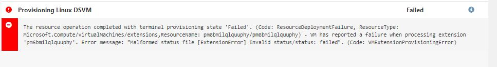

**Provisioning Linux DSVM Failure**

  If the solution fails in the last step with the below message. Please follow the instructions provided to resolve it.

  
  
   *Instructions*

   1. Please navigate to the DSVM resource in the Azure portal and uninstall the extension.

        
        

   2. Go back to the deployment and click on retry and it should go through. If not please report the issue.
